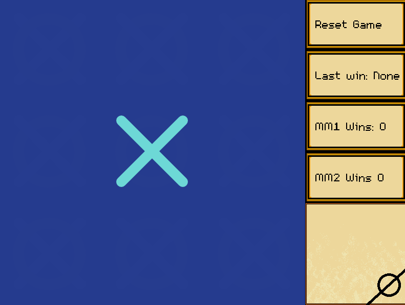

# AI Playground
 
A collection of various small AI projects.
## Table of Contents
* [General info](#general-info)
* [Projects in the Repo](#projects)
* [Screenshots](#screenshots)
### General info
This is my all purpose repo for AI-related projects. I use it to back up my work and catalog my exploration of the field.
### Projects
- MinMax Algorithm for Tic Tac Toe
- Deep Q Learning Agent for Tic Tac Toe
- Genetic Algorithm for Dice Bingo
- Basic Q Learning Tutorial Code
- NEAT algorithm for playing flappy bird
- A variety of small deep learning and q learning programs

### Screenshots
2 MinMax Agents playing each other in Tic Tac Toe 

 NEAT algorithm playing Flappy Bird 

