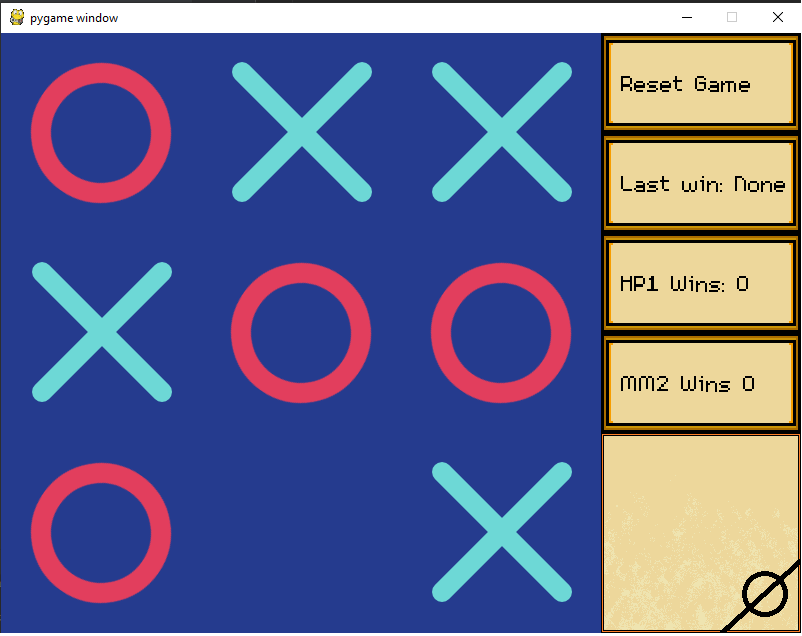

# TicTacToe AI
Pygame environment for testing a variety of algorithms to play tic tac toe
## Table of Contents
* [General info](#general-info)
* [Features](#features)
* [Setup](#setup)
* [Screenshots](#screenshots)
### General info
It's tic tac toe and algorithms that play it. Oh, there's a GUI also.
- Language: Python
- Libraries: pygame for rendering
### Features
- MinMax Algorithm
- Human Players
- Random Agents
- (NOT YET IMPLEMENTED) Neural Net Agent
### Setup
Clone the repository, install pygame and if you do not have it and then run main.
### Screenshots

